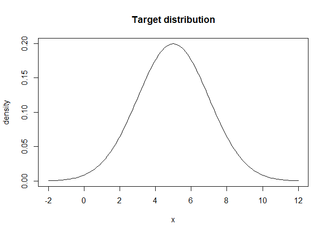
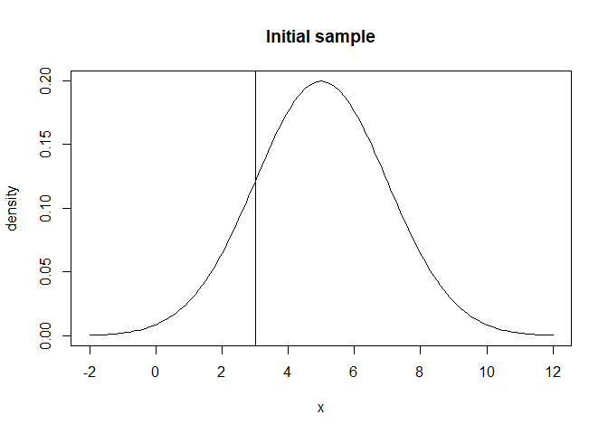
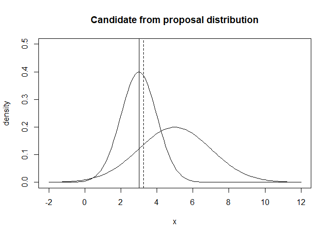
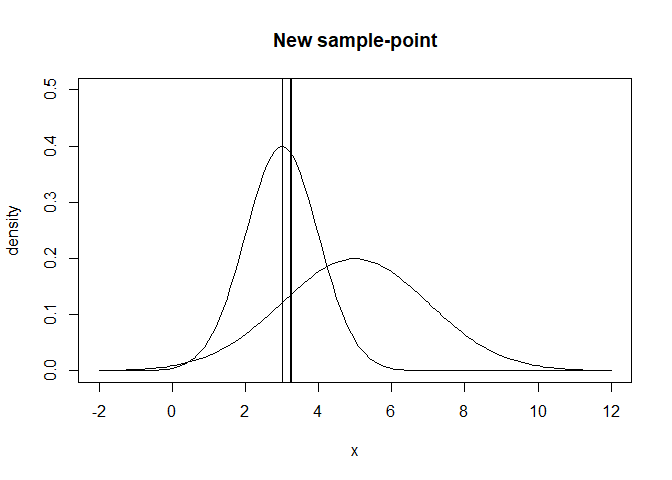
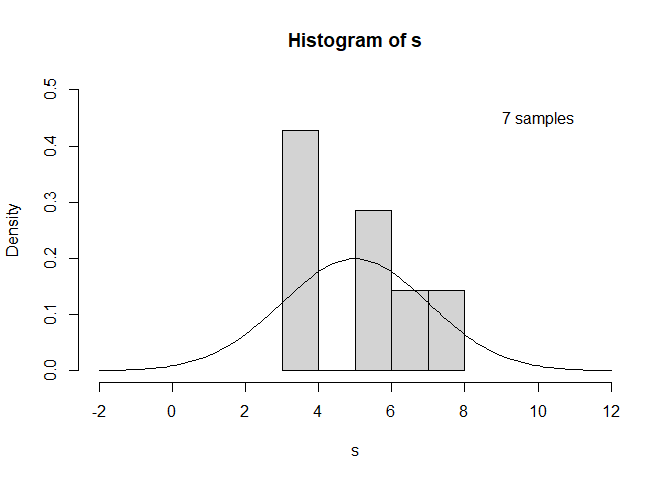

Illustration of the Metropolis algorithm
================
Robin Aldridge-Sutton

``` r
library(gifski)
```

    ## Warning: package 'gifski' was built under R version 4.0.2

This is an MCMC algorithm, it produces a Monte Carlo sample from a
Markov chain that converges to a target distribution. Its defining
feature is having a symmetric proposal distribution.

``` r
# Plot Normal(5, 2) target density
x <- seq(-2, 12, 0.1)
f <- dnorm(x = x, mean = 5, sd = 2)
plot(x, f, type = 'l', ylab = 'density', main = 'Target distribution')
```

<!-- -->

It starts with an arbitrary sample.

``` r
# First sample = 1
x_t <- 3

# Add to sample
s <- x_t

# Plot everything
plot(x, f, type = 'l', ylab = 'density', main = 'Initial sample')
abline(v = x_t)
```

<!-- -->

Then it draws a sample from a given symmetric proposal distribution,
centered at the previous sample.

``` r
# Normal(x_t, 1) proposal density
g <- dnorm(x = x, mean = x_t, sd = 1)

# Generate candidate
x_prime <- rnorm(n = 1, mean = x_t, sd = 1)

# Plot everything
plot(x, f, type = 'l', ylab = 'density', ylim = c(0, 0.5),
     main = 'Candidate from proposal distribution')
abline(v = x_t)
lines(x, g)
abline(v = x_prime, lty = 2)
```

<!-- -->

An acceptance ratio is calculated from the target densities at the
candidate and previous sample-points. The candidate is then added to the
sample if a random uniform sample is smaller that this probability. So
if the density is greater at the candidate sample it is always accepted,
and otherwise it is accepted with probability the acceptance ratio. If
the candidate is rejected the previous sample is repeated instead.

``` r
# Calculate acceptance ratio of target densities of candidate to previous
# sample - can also use function proportional to target density
alpha <- 
  dnorm(x = x_prime, mean = 5, sd = 2) / dnorm(x = x_t, mean = 5, sd = 2)

# Plot everything
plot(x, f, type = 'l', ylab = 'density', ylim = c(0, 0.5),
     main = 'New sample-point')
abline(v = x_t)
lines(x, g)
abline(v = x_prime, lty = 2)

# Accept or reject with probability alpha
abline(
  v = ifelse(runif(n = 1, min = 0, max = 1) <= alpha, x_prime, x_t), 
  lwd = 2
)
```

<!-- -->

``` r
# Add to sample
s <- c(s, x_t)
```

This process eventually converges to sample from the target
distribution.

``` r
add_sample <- function(s) {
  # Get last sample
  x_t <- tail(s, 1)
  
  # Generate candidate
  x_prime <- rnorm(n = 1, mean = x_t, sd = 1)
  
  # Calculate acceptance ratio of target densities of candidate to previous
  # sample - can also use function proportional to target density
  alpha <- 
    dnorm(x = x_prime, mean = 5, sd = 2) / dnorm(x = x_t, mean = 5, sd = 2)
  
  # Accept or reject with probability alpha
  if (runif(n = 1, min = 0, max = 1) <= alpha) x_t <- x_prime
  
  # Add to sample
  s <- c(s, x_t)
  
  return(s)
}
```

<!-- -->

Next I should prove the convergence mathematically?

How do we know it converges when only the moves towards lower target
density samples are accepted with probability the ratio of the
densities? Well if it converges it must be moving down …?
